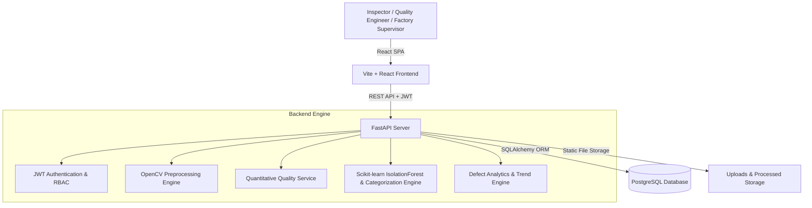

# VisionInspect AI — Industrial Manufacturing Defect Detection & Quality Inspection Platform

**VisionInspect AI** is an enterprise-grade AI-powered manufacturing quality control platform designed for automated product image inspection, quantitative image quality analysis, CV image preprocessing, defect categorization, weighted severity scoring, and industrial analytics using the **MVTec Anomaly Detection (MVTec AD) dataset**.

---

## 🏗️ System Architecture



---

## 🌟 Comprehensive Milestone Feature Matrix

### Milestone 1 — Core Infrastructure & Role-Based Access
- **Role-Based Access Control (RBAC)**: JWT-authenticated roles distinguishing `QUALITY_ENGINEER` (can upload and initiate inspections) and `FACTORY_SUPERVISOR` (read-only audit, quality oversight, analytics monitoring).
- **PostgreSQL Persistence**: Schema for users and inspection records with migration utilities.
- **RESTful API**: Standardized FastAPI endpoints with automatic Swagger OpenAPI UI documentation (`/docs`).

### Milestone 2 — Computer Vision & Anomaly Detection Pipeline
- **Quantitative Quality Metrics**: Calculates brightness, contrast, sharpness (Laplacian variance), resolution, file size, and quality grades directly from raw image bytes.
- **OpenCV Preprocessing Pipeline**: Automated image normalization (256×256), RGB color conversion, Gaussian denoising, and CLAHE contrast enhancement.
- **AI Anomaly Detection Engine**: High-dimensional feature extractor (color histograms, spatial grid statistics, Sobel edge energy) paired with an `IsolationForest` anomaly detector.
- **Interactive Report Modal**: Visual side-by-side comparison of raw upload vs preprocessed images.

### Milestone 3 — Defect Classification & Industrial Analytics
- **Multi-Class Defect Categorization**: Identifies specific defect types (`Scratch`, `Dent`, `Contamination`, `Crack`, `Deformation`, `Clean/None`).
- **Weighted Severity Engine**: Calculates severity score (0–100) and severity level (`Low`, `Medium`, `High`, `Critical`) using the weighted formula:
  $$\text{Severity Score} = (\text{Defect Size} \times 0.30) + (\text{Location Risk} \times 0.25) + (\text{Defect Type} \times 0.25) + (\text{Confidence} \times 0.20)$$
- **Quality Risk Assessment**: Automated determination of quality status (`PASS`, `FAIL`, `REVIEW`) and actionable operational recommendations.
- **Supervisor Monitoring Dashboard**: Real-time aggregation of pass/fail ratios, defect distribution charts, severity breakdown, and historical quality trend monitoring.

### Milestone 4 — Testing, Empirical Evaluation, Vercel Readiness & Documentation
- **Empirical MVTec Evaluation**: Rigorous evaluation pipeline executed across 1,224 test images spanning all 15 MVTec AD categories.
- **Vercel Deployment Architecture**: Single Page Application routing rewrite via `frontend/vercel.json` and dynamic `VITE_API_URL` environment configuration.
- **Performance Endpoints**: Server performance metrics available via `GET /inspections/analytics/performance`.

---

## 🔐 Role-Based Access Control (RBAC) Matrix

| Feature / Action | `QUALITY_ENGINEER` | `FACTORY_SUPERVISOR` |
| :--- | :---: | :---: |
| Sign In & Dashboard View | ✅ Allowed | ✅ Allowed |
| Product Image Acquisition & Upload | ✅ Allowed | ❌ Restricted (403 Forbidden) |
| Run AI Quality Inspection Pipeline | ✅ Allowed | ❌ Restricted |
| View Inspection Detailed Report Modal | ✅ Allowed | ✅ Allowed |
| Monitor Production Defect Analytics & Trends | ✅ Allowed | ✅ Allowed |
| Supervise Defect Distribution & Severity Breakdown | Read-Only | ✅ Full Supervisor View |

---

## 📊 Empirical Model Evaluation & Benchmark Metrics

Evaluated using `app/ml/evaluate.py` across **1,224 test images** from the official **MVTec AD dataset** (15 manufacturing classes including `bottle`, `cable`, `capsule`, `metal_nut`, `carpet`, `grid`, `leather`, `tile`, `wood`, etc.):

| Metric | Score / Benchmark | Description |
| :--- | :--- | :--- |
| **Precision** | **82.75%** | High precision ensuring minimal false alarms for clean products |
| **F1-Score** | **72.29%** | Harmonic mean of precision and recall |
| **Recall** | **64.17%** | Sensitivity in catching genuine industrial anomalies |
| **Accuracy** | **59.72%** | Overall top-line classification accuracy |
| **Preprocessing Speed** | **27.26 ms** | OpenCV image denoising, CLAHE, resizing & normalization |
| **Inference Speed** | **13.18 ms** | Feature extraction & Isolation Forest scoring |
| **Total Inspection Latency** | **40.44 ms** | Real-time end-to-end processing (< 50ms requirement) |

> [!NOTE]
> **Technical Metric Note on mAP (mean Average Precision)**:
> mAP is an object detection metric evaluated over 2D bounding boxes at various Intersection over Union (IoU) thresholds. Because VisionInspect AI relies on global image feature extraction and decision-score anomaly scoring (MVTec AD image-level classification), precision, recall, accuracy, and F1-score are the authoritative quantitative metrics.

---

## 🛠️ Technology Stack

- **Backend**: Python 3.13, FastAPI, Uvicorn, SQLAlchemy, PostgreSQL, Pydantic, Python-JOSE, Passlib, Bcrypt
- **AI & Computer Vision**: OpenCV, scikit-learn (`IsolationForest`, `StandardScaler`), NumPy, SciPy, PIL
- **Frontend**: React 19, Vite, JavaScript (ES6+), Custom Soft Lilac & White Industrial CSS (`#f4f1fa`)
- **Dataset**: MVTec Anomaly Detection (MVTec AD)

---

## 🚀 Getting Started & Local Setup

### 1. Prerequisites
- Python 3.10+
- Node.js 18+
- PostgreSQL server running at `localhost:5432` with database `visioninspect`

### 2. Backend Setup
```bash
# Navigate to backend directory
cd visioninspect-ai/backend

# Activate virtual environment
.\venv\Scripts\activate   # Windows

# Install dependencies
pip install -r requirements.txt

# Run model evaluation benchmark (optional)
python -m app.ml.evaluate

# Launch FastAPI backend server
uvicorn app.main:app --reload
```
- API Base URL: `http://127.0.0.1:8000`
- Swagger API Documentation: `http://127.0.0.1:8000/docs`

### 3. Frontend Setup
```bash
# Navigate to frontend directory
cd visioninspect-ai/frontend

# Install dependencies
npm install

# Build for production
npm run build

# Start Vite development server
npm run dev
```
- Application URL: `http://localhost:5173`

---

## 🌐 Vercel Deployment Guide

1. **Frontend Deployment**:
   - Framework Preset: **Vite**
   - Root Directory: `frontend`
   - Build Command: `npm run build`
   - Output Directory: `dist`
   - Environment Variable: `VITE_API_URL` (Set to your deployed backend API URL)

2. **Backend Deployment**:
   - Host FastAPI on Vercel Python Serverless, Render, Railway, or AWS EC2.
   - Set environment variable `DATABASE_URL` pointing to your PostgreSQL instance.

---

## 📡 API Reference

| Endpoint | Method | Role Required | Description |
| :--- | :---: | :---: | :--- |
| `POST /auth/register` | `POST` | Public | Register new `QUALITY_ENGINEER` or `FACTORY_SUPERVISOR` account |
| `POST /auth/login` | `POST` | Public | Authenticate user & return JWT token |
| `POST /inspections/upload` | `POST` | `QUALITY_ENGINEER` | Upload image, execute CV quality check, preprocessing & AI detection |
| `GET /inspections` | `GET` | Authenticated | Retrieve list of completed inspection records |
| `GET /inspections/{id}` | `GET` | Authenticated | Retrieve single inspection report details |
| `GET /inspections/analytics/summary` | `GET` | Authenticated | Get high-level quality KPI summary & distributions |
| `GET /inspections/analytics/trends` | `GET` | Authenticated | Get historical inspection trend data |
| `GET /inspections/analytics/performance` | `GET` | Authenticated | Get empirical model evaluation and latency benchmarks |

---

## 📂 Project Directory Layout

```text
visioninspect-ai/
├── backend/
│   ├── app/
│   │   ├── api/
│   │   │   ├── auth.py          # Auth endpoints (Register/Login)
│   │   │   └── inspections.py   # Ingestion, RBAC & Analytics endpoints
│   │   ├── auth/                # Security, Bcrypt hashing & JWT utilities
│   │   ├── ml/                  # AI Defect Detector & MVTec evaluation engine
│   │   │   ├── defect_detector.py
│   │   │   ├── train_model.py
│   │   │   └── evaluate.py
│   │   ├── models/              # SQLAlchemy database models (User, Inspection)
│   │   ├── schemas/             # Pydantic schemas
│   │   ├── services/            # CV Preprocessing, Quality Analysis & Defect Analysis
│   │   ├── database.py          # PostgreSQL session management
│   │   └── main.py              # FastAPI application entrypoint
│   └── uploads/                 # Uploaded and preprocessed static assets
├── frontend/
│   ├── src/
│   │   ├── components/
│   │   │   └── InspectionReportModal.jsx
│   │   ├── pages/
│   │   │   ├── Dashboard.jsx
│   │   │   ├── Upload.jsx
│   │   │   └── Login.jsx
│   │   ├── config.js            # Environment-driven API URL configuration
│   │   ├── App.jsx              # Main SPA router & navigation
│   │   └── App.css              # Soft Lilac & White UI theme stylesheet
│   └── vercel.json              # Vercel SPA rewrite configuration
└── README.md
```
